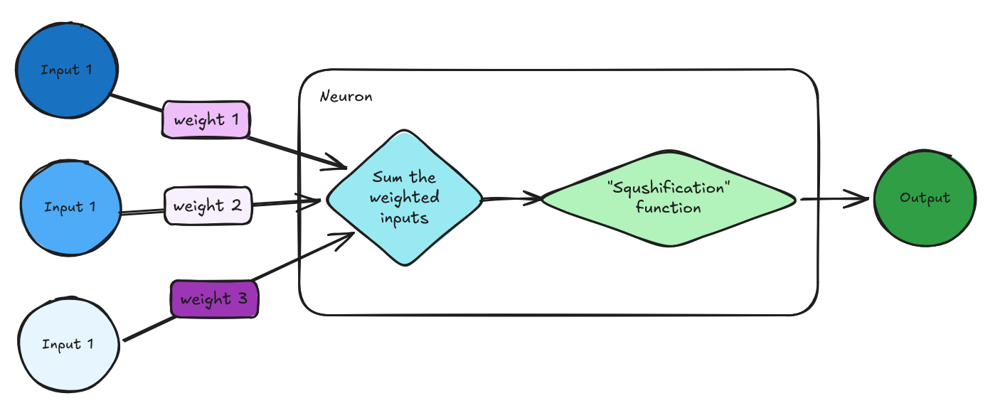

:::::::::::::::::::::::::::::::::::::: questions

-

::::::::::::::::::::::::::::::::::::::::::::::::

::::::::::::::::::::::::::::::::::::: objectives

-

::::::::::::::::::::::::::::::::::::::::::::::::

## The Most Basic Network - A Perceptron

Let's start off with the most basic version of any type of neural network classifier: the
perceptron. A perceptron consists of a single "neuron" that accepts multiple input signals, applies
weights to each input, sums the weighted inputs, and then applies a function to the output to
produce the final output. This simple model forms the foundation for more complex neural networks.

A Perceptron model might look something like this:



Let's code a simple perceptron to start with. We'll mimic the structure of the sklearn models, so
we'll define a class with `fit` and `predict` methods. (We'll fill in the `fit` method later)

```python
import numpy as np

class Perceptron:
    def __init__(self, input_size):
        self.weights = np.zeros(input_size)

    def fit(self, X_train, y_train):
        pass

    def predict(self, X: np.array):
        total = np.dot(self.weights, X)
        return 1 if total > 0 else 0
```

We can create a new instance of our model like this:

```python
model = Perceptron(input_size=3)
```

### Training a Perceptron

Now, the issue at the moment is that we have no way of teaching our perceptron anything about the
data we have. As it will multiple every input by the weight "0", the sum will be 0 and the output
will always be 0.

To start with, we need some data. As this is a simple model, let's start with a simple decision by
a simple creature: a very handsome but not particularly bright dog named "Wally". Wally is trying
to determine if he will get to go on a walk. The inputs he has are simple binary features:
- Am I wearing my collar?
- Did the human just put shoes on?
- Did I show the human my stuffed animal?

Wally has done some observations in the past few weeks and has noted if he got to go on a walk or
not based on these features:

```
Collar? | Shoes? | Stuffed animal? | walk?
--------|--------|-----------------|-------
1       | 1      | 1               | 1
1       | 1      | 0               | 1
0       | 1      | 0               | 0
0       | 0      | 1               | 0
```

Let's put this in a format that we can use to train our perceptron:

```python
X = np.array(
    [
        [1, 1, 1],
        [1, 1, 0],
        [0, 1, 0],
        [0, 0, 1],
    ]
)
y = np.array([1, 1, 0, 0])

```

We now need to fill out our `fit` method. Let's start with our first idea - we roll through all of
our training examples one by one. We predict the output for each example, than calculate the error
between the predicted output and the actual label. Based on the error, we adjust the weights and
move on to the next example. Let's fill out our `fit` method to update our weights based on some
inputs and see how it works:

```python
import numpy as np

class Perceptron:
    def __init__(self, input_size):
        self.weights = np.zeros(input_size)

    def fit(self, X_train, y_train):
        for inputs, label in zip(X_train, y_train):
            prediction = self.predict(inputs)
            error = label - prediction
            print("Inputs:", inputs, "Correct?", label == prediction)
            print("Error:", error)

            for i, weight in enumerate(self.weights):
                new_weight = weight + error * inputs[i]
                print(f"Weight {i}: {weight} -> {new_weight}")
                self.weights[i] = new_weight

    def predict(self, X):
        total = np.dot(self.weights, X)
        return 1 if total > 0 else 0

model = Perceptron(input_size=3)

model.fit(X, y)
```

Our output looks like this:

```output
Inputs: [1 1 1] Correct? False
Error: 1
Weight 0: 0.0 -> 1.0
Weight 1: 0.0 -> 1.0
Weight 2: 0.0 -> 1.0
Inputs: [1 1 0] Correct? True
Error: 0
Weight 0: 1.0 -> 1.0
Weight 1: 1.0 -> 1.0
Weight 2: 1.0 -> 1.0
Inputs: [0 1 0] Correct? False
Error: -1
Weight 0: 1.0 -> 1.0
Weight 1: 1.0 -> 0.0
Weight 2: 1.0 -> 1.0
Inputs: [0 0 1] Correct? False
Error: -1
Weight 0: 1.0 -> 1.0
Weight 1: 0.0 -> 0.0
Weight 2: 1.0 -> 0.0
```

Ok, stuff is happening, but the weights are updating too wildly - they're just jumping back and
forth between 0 and 1. We should limit the size of each update by multiplying the error with a
value less than 1, often called the **learning rate**. Let's implement this:

```python
import numpy as np

class Perceptron:
    def __init__(self, input_size, learning_rate=0.1): # Add learning rate parameter
        self.weights = np.zeros(input_size)
        self.learning_rate = learning_rate # Store the learning rate for weight updates

    def fit(self, X_train, y_train):
        for inputs, label in zip(X_train, y_train):
            prediction = self.predict(inputs)
            error = label - prediction
            print("Inputs:", inputs, "Correct?", label == prediction)
            print("Error:", error)

            for i, weight in enumerate(self.weights):
                new_weight = weight + self.learning_rate * error * inputs[i] # Update weight with learning rate
                print(f"Weight {i}: {weight} -> {new_weight}")
                self.weights[i] = new_weight

    def predict(self, X):
        total = np.dot(self.weights, X)
        return 1 if total > 0 else 0

model = Perceptron(input_size=3)

model.fit(X, y)
```

```output
Inputs: [1 1 0] Truth: 1 Prediction: 0
Error: 1
Weight 0: 0.0 -> 0.01
Weight 1: 0.0 -> 0.01
Weight 2: 0.0 -> 0.0
Inputs: [0 1 1] Truth: 1 Prediction: 1
Error: 0
Weight 0: 0.01 -> 0.01
Weight 1: 0.01 -> 0.01
Weight 2: 0.0 -> 0.0
```

Let's finish adding in the data from our training set:

```python
X_train = np.array(
    [
        [1, 1, 0],
        [1, 1, 1],
        [0, 1, 0],
        [0, 0, 1],
        [1, 1, 1],
        [1, 0, 0],
        [1, 0, 0],
        [0, 1, 1],
        [1, 1, 0],
        [1, 0, 1],
        [1, 1, 1],
        [0, 0, 0],
        [1, 0, 1]
    ]
)
y_train = np.array([1,1,0,0,1,0,0,0,1,0,1,0,0])
model.fit(X_train, y_train)
```

and now let's look at the weights for our model:

```python
model.weights
```

```output
array([0.1, 0.1, 0. ])
```


### Visualizing the Decision Space


::::::::::::::::::::::::::::::::::::: challenge

## Challenge 1: Can you do it?

What is the output of this command?

```r
paste("This", "new", "lesson", "looks", "good")
```

:::::::::::::::::::::::: solution

## Output

```output
[1] "This new lesson looks good"
```

:::::::::::::::::::::::::::::::::


::::::::::::::::::::::::::::::::::::::::::::::::


::::::::::::::::::::::::::::::::::::: keypoints

-

::::::::::::::::::::::::::::::::::::::::::::::::

